#

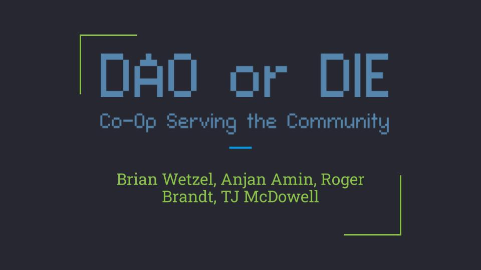

### 
DAO or DIE is a cooperative network of individuals and groups who seek through direct action to improve wellbeing in our communities. We are made up of households, collectives, and autonomous spaces that have come together peacefully to support one another and the common ground that surrounds us. Our unity is bolstered by our dynamic use of blockchain technology in light of our guiding principles: mutuality, transparency, and promoting quality of life.

#
#

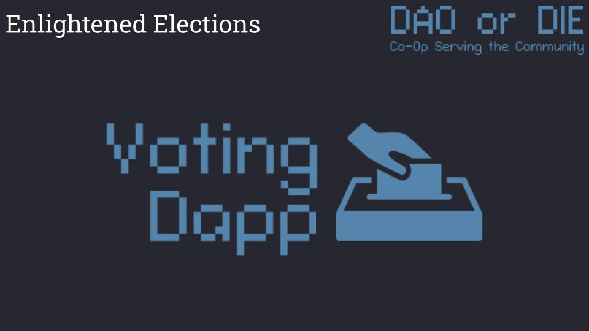

### 
Our goal for this project was to make an efficient and accessible voting system for our constituents so they may directly participate in our actions as a decentralized society. Our objectives were to include the following polling attributes:
<ul>
<li> Remote voting capabilities </li>
<li> One step validation of voting rights </li>
<li> Pseudonymous voting records
<ul>
<li> Visible transaction data, but no private information kept on-chain </li>
</ul>
<li> Incentive to participate </li>
</ul>

#
#

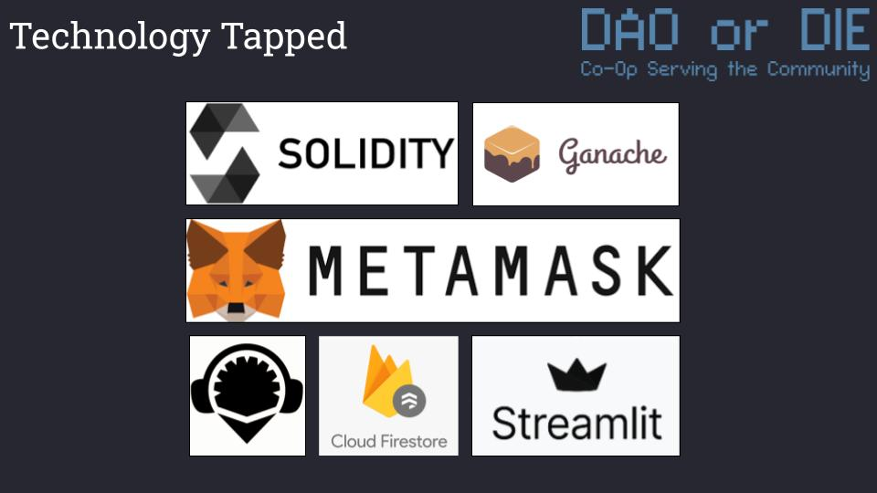

### 
For proof-of-concept development and demonstration purposes, the voting system was deployed via ethereum smart contract on a local testnet. The technologies used included:
<ul>
<li>Solidity / Remix IDE for contract development </li>
<li>Ganache for establishing our local testnet </li>
<li>MetaMask for digital wallet management </li>
<li>Python / Streamlit for web app deployment </li>
<li>Cloud Firestore for cloud storage of contract transactions, in this case for storing the votes for the UX/UI demo </li>
</ul>

#
#

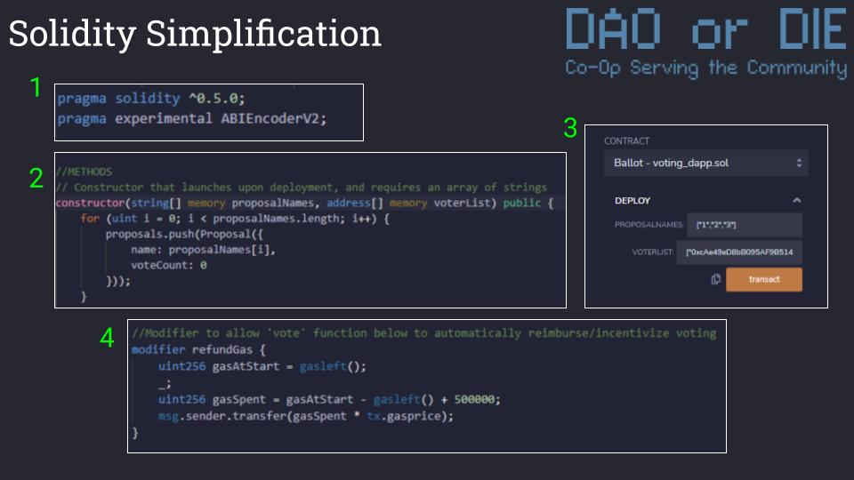

### 
In our solidity code we used pragma experimental ABI Encoder V2 (Fig. 1) which allowed us to input strings as proposal names within the contract (Fig. 2 & Fig. 3). Without this experimental encoder, we would have to use “Bytes32” objects for proposal data which compromised transparency.   We also created a function modifier which tracks the cost of gas to use the voting function and then automatically reimburses those fees to the voter (plus ~$25) , thus incentivizing participation.
#
#
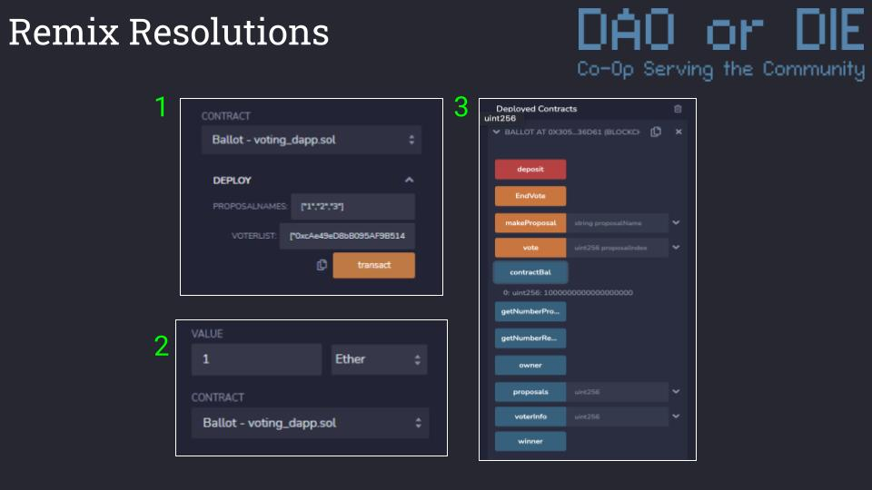

### 
The chairperson must input arrays of both proposals and registered wallet addresses into the IDE interface prior to contract deployment (Fig. 1). After deploying the contract, the chairperson has a list of functions available to them through the IDE (Fig 3). This includes real time vote counts, boolean data as to whether a pre-registered address has voted, and the ability to start and end voting by depositing ethereum to the contract and withdrawing it, respectively.   Before voting can begin the chairperson must deposit Ethereum to the contract (Fig 2). This allows for the proper functioning of the reimbursement/incentive feature. Activating the ‘End Vote’ function drains the remaining funds from the contract back to the central account thus inhibiting further remote interaction with the voting function.

#
#
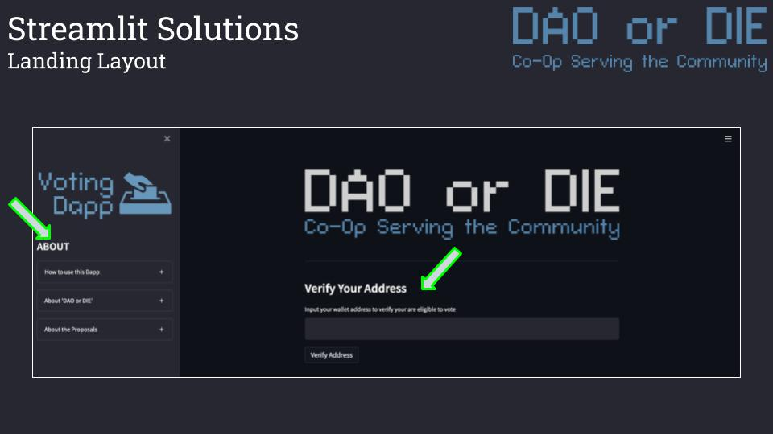

### 
This is the landing page for the web interface coded in python and deployed using streamlit. The arrow on the left points to three drop down menus which you will see expanded on the following image. The arrow to the right points to the public address verification which is also outlined below.

#
#
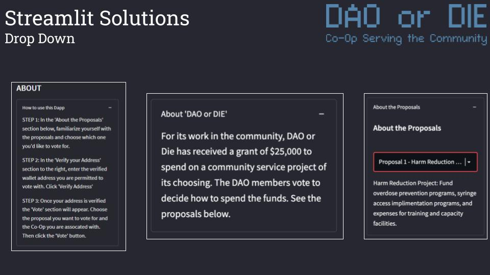

### 
These are examples of the three drop down menus on the left side of our landing page. The first gives instructions on how to interact with the voting feature. The middle contains a high level explanation of the current vote. The third goes further in depth with each proposal. To illustrate, in this example the organization is voting to decide how to distribute funds from a recent grant. Our proposals include orchestrating a Harm Reduction effort, designing a volunteer after-school program for at-risk school systems, or planning a coordinated community clean-up action.

#
#
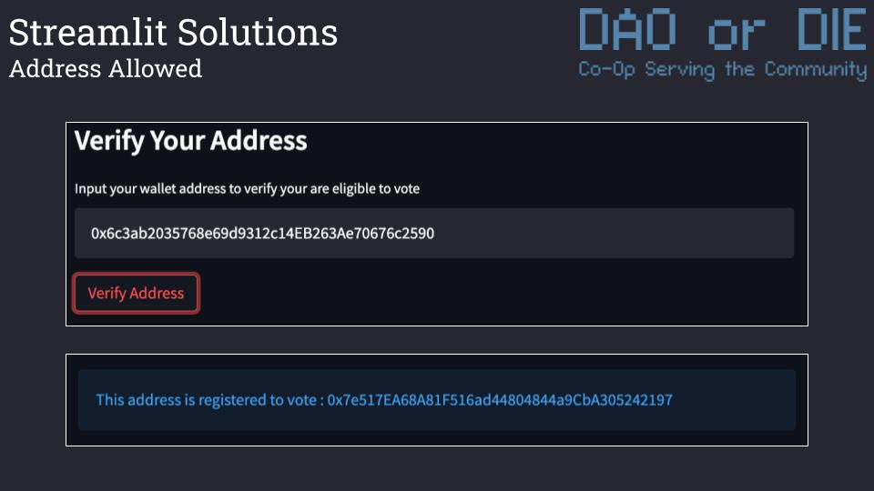

### 
Each member or representative puts their predetermined public address into an input box prior to voting. You may recall these addresses have been coded into the smart contract via its constructor, so there would be a necessary pre registration step on the organizational level prior to deployment. The addresses have also been placed into the streamlit/python script prior to the web apps deployment as well. No other identification is completely necessary at the time of voting.

#
#
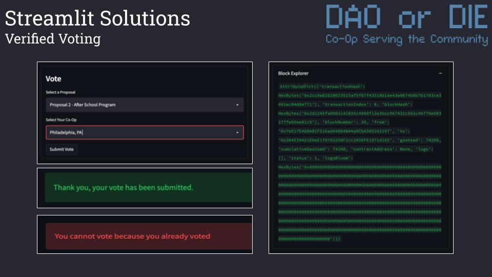

### 
The first easy-to-use dropdown menu provides each proposal and a shorthand reminder of what the proposal is. This is where the voter selects what proposal is going to get their vote. This example includes a second drop-down asking constituents to input their city, but this is not information that is kept on-chain. This just demonstrates the potential for adding in more or less stringent voting policies and validation efforts based on the sentiment of the collective. Having geographic information as part of the validation process allows for a higher level of internal auditing of votes.   If the voter/public address does not have a vote already recorded on-chain, then they will see the green output confirming the tallying of their vote. Should they be up to any deviant malarkey and try to vote more than once, they will see the red error at the bottom.   On the right you will see the transaction hash data after your vote has been submitted, confirming its presence on the chain.

#
#
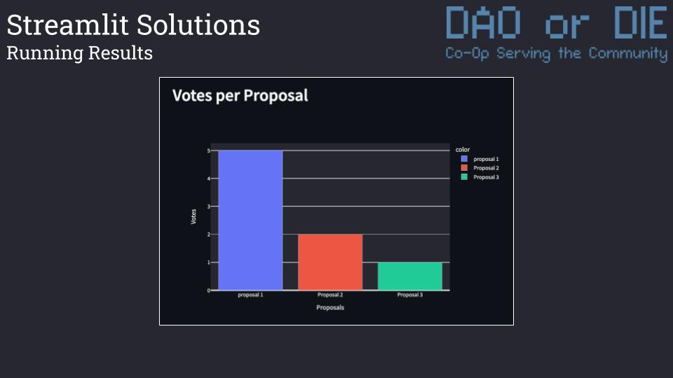

### 
 Once the vote has been cast the voter is presented with visualized real-time polling data pulled directly from the blockchain via Web3.py. This is another checks-and-balances measure that can be included in the voting process to enhance transparency. There are several prospective ways to incorporate such a feature into the voting experience. We chose to display the voting data after someone votes so as to minimize the potential for voter persuasion.
[Click Here For A Video Demo](https://youtu.be/X69WVc_qKJA) 
#
#
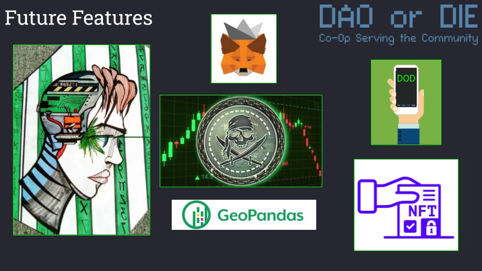

### 
We hope by now you are starting to become convinced of DAO or DIE's absolute commitment to mutuality, transparency, and promoting quality of life. With your help, we seek to continue to build on this idea for a digitally maximized revolution in the following ways:
<ul> 
<li>First, we would like to improve functionality of our web app by learning Javascript, thus being able to link metamask directly with our interface. 
<li>We would also seek to design a mobile friendly app or interface with RFID technology wired in. This way, members would have a card or device with their public key one tap away from accessing our blockchain democracy. 
<li>We also believe that we would be able to enhance security by incorporating geographic information in our data visualizations. 
<li>Other DAO voting systems have included the use of NFTs, and we would use resources to be able to research and develop in this area. 
<li>Finally, we seek to mint our own fungible token with the hopes of further advancement & facilitation of our own in-house mutual-aid efforts.

#
#
